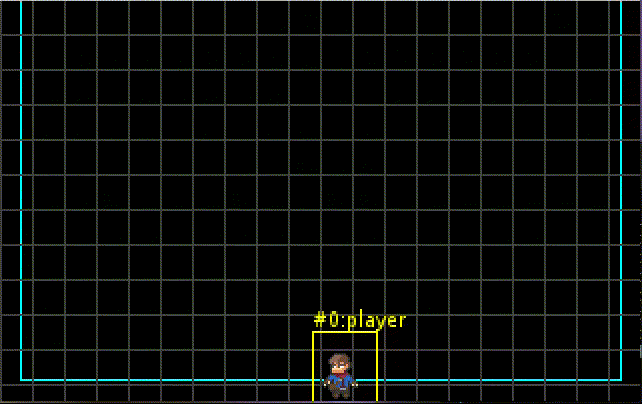

# README

[](http://nextserver02-1/SnapGames/simplegameclass)

A simple `Game`  class project will all inside to provide basics for 2D game framreowkr based on the JDK 19 only.

- One master class with subclasses to define principle and reduce footprint.
- No specific java build tool like maven or gradle, but only bash scripts with java/javac JDK commands. any specific
  dependencies may be store in the lib directory for build or test usage.

## build

```bash
build.sh 
```

## run

```bash
java -jar target/simpleclass.jar
```

Available CLI arguments & configuration file parameters:

| Configuration          | Argument   | Type      | Description                                                     |
|:-----------------------|:-----------|:----------|:----------------------------------------------------------------|
| game.size              | size       | Dimension | define window dimension: `(width)x(height)`                     |
| game.screen.resolution | resolution | Dimension | Define Screen resolution `(width)x(height)`                     |
| game.physic.play.area  | playarea   | Dimension | Define the physic module play area dimension `(width)x(height)` |
| game.physic.gravity    | gravity    | Double    | Define the physic module gravity value `0.981`                  |
| game.title             | title      | String    | define the title for the game window `My Own Title`             |
| game.debug             | debug      | Integer   | set the debug information level `0` to `5` where 0 = no info    |

Any argument can be activated by using the command line option :

```bash
java -jar target/simpleclass.jar game.title=ThisIsMyWindow
```

> **NOTE**
>
> An internal configuration file `config.properties` is provided into the JAR itself, but you can overload the
> properties with t a side part `my-config.properties` file, located at the root place of the JAR file.
> ```
> path_to_my_jar/
> |_ simplegameclass.jar
> |_ my-config.properties
> ```
> Now executing the JAR file, default values will be loaded from internal file, and then every `key=value` from
> `my-config.properties` will overload those default values.


A new window running the demonstration game will appear with "ThisIsMyWindow" as title.



McG.
