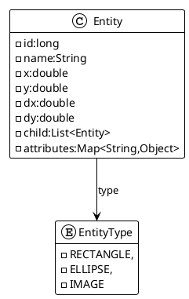

# Adding Entity and EntityType

The `Entity` is a class to define all the moving (or not) object on screen.
The `EntityType` define the type of rendering and management.

```plantuml
@startuml
!theme plain
hide Entity methods
class Entity{
    - id:long
    - name:String
    - x:double
    - y:double
    - dx:double
    - dy:double
    - child:List<Entity>
    - attributes:Map<String,Object>
}
hide EntityType methods
enum EntityType{
    - RECTANGLE,
    - ELLIPSE,
    - IMAGE
}
Entity --> EntityType:type
@enduml
```

