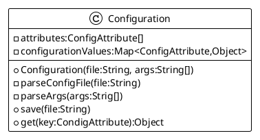

# Configuration

## Goals

The COnfiguration principle consists in loading values from a properties file into a map wich keys are enumeratioin entries, and typed values the conversion of properties values into some required objects.

## Proposed design

The enumration entry will be of type :

```java
public enum ConfigAttribute {
    MY_VALUE(
        "game.phusic.gravity", // the property key entry
        "gravity,g", // the possible CLI arguments (long and short)
        "The gravity value used by physic engine computation and affects every Entity in the World game, defaut is set to no gravity." , // all is in the text ;)
        0.0, // the default value if no entry provided
        v->Double:valueOf), // the way to parse the string value and convert it to the a required type (thanks to the Java Function interface).
    //...
    ;
}
```
You can add any other entry in the enum to define new confguration key/values.

Anatomy of a `ConfigAttribute` enum entry:

- a `String` fo rthe configuration attribute entry, 
- a `coma separated list of String` to define the possible CLI arguments (long and short)
- a clear and understandable description as a `String` for this configuration entry. this text will be displayed as help when requested.
- an `Object` instance as a default value (eg.0.0 for a double, "blabla" for a String, ttc...)
-  a Java `Function<i,o>` implementation to convert the loaded String form an entry in the properties file or the argument value from the command line to the required data type.

And from the config.propeties file, the corresponding entry :

```properties
# this configuration key is a double value
game.physic.gravity=0.981
```

This property value can be overriden through java command line argument:`

```bash
$> java -jar simplegameclass-1.0.jar gravity=0.981
```

## File Rules

1. The `config.properties` file is provided as default values for the full game framework in the jar itself.
2. if a `my-config.properties` is provided in the same location as the JAR file itself, all entries in this properties file will be used to override already defined values by the new provided ones.
3. As soon a value has been modified through a command line argument a `backup.properties` is saved in the same root path os the jar itself.

## The `Configuration` service

The service will provide 
4. all the required default behavior to satisfy the File rules. 
5. the required API to let a specific configuration file to be loaded (to be used for unit test purpose)
6. an entry point to intiialize the internal configuration value object from the file and from the arguments passed from the common Java main method.

### The Configuration class design



From the command line, 

7. if an unknown attribute is used, the program exit without execution, but with a clear message giving an error message.
8. the user can request to display help for the game arguments with the 'help' or '?' first argument

```bash
$> java -jar simplegameclass-1.0.jar help
```

9. when the Configuraton properties file is read and parsed, some clear INFO level messages output the detected values for each entry.
10. If an unkown values is used, the program properly exits without execution, but with a help message giving the error message about the unknown attribute.

To use an initiazed configruation value :

```java
Configuration config = new Configuration( 
    "/config.properties", 
    new String[]{} );

String windowTitle = config.get(
    ConfigAttribute.WINDOW_TITLE);
```

for a properties entry like :

```properties
game.window.title="My title window"
```
