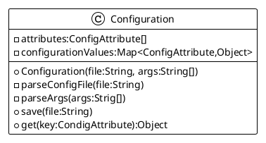

# Configuration

## Goals

The `Configuration` principle consists in loading values from a properties file into a map which keys are enumeration
entries, and typed values the conversion of properties values into some required objects.

## Proposed design

The enumeration entry will be of type :

```java
public enum ConfigAttribute {
    MY_VALUE(
            "game.physic.gravity", // the property key entry
            "gravity,g", // the possible CLI arguments (long and short)
            "The gravity value used by physic engine computation and affects every Entity in the World game, defaut is set to no gravity.", // all is in the text ;)
            0.0, // the default value if no entry provided
            v -> Double::valueOf), // the way to parse the string value and convert it to the required type (thanks to the Java Function interface).
    //...
    ;
}
```

You can add any other entry in the enum to define new configuration key/values.

Anatomy of a `ConfigAttribute` enum entry:

- a `String` for the configuration attribute entry,
- a `coma separated list of String` to define the possible CLI arguments (long and short)
- a clear and understandable description as a `String` for this configuration entry. this text will be displayed as help
  when requested.
- an `Object` instance as a default value (eg.0.0 for a double, "blablabla" for a String, ttc...)
- a Java `Function<i,o>` implementation to convert the loaded String form an entry in the properties file or the
  argument value from the command line to the required data type.

And from the `config.propeties` file, the corresponding entry :

```properties
# this configuration key is a double value
game.physic.gravity=0.981
```

This property value can be overridden through java command line argument:`

```bash
$> java -jar simplegameclass-1.0.jar gravity=0.981
```

## File Rules

1. The `config.properties` file is provided as default values for the full game framework in the jar itself.
2. if a `my-config.properties` is provided in the same location as the JAR file itself, all entries in this properties
   file will be used to override already defined values by the new provided ones.
3. As soon a value has been modified through a command line argument a `backup.properties` is saved in the same root
   path os the jar itself.

## The `Configuration` service

The service will provide

4. all the required default behavior to satisfy the File rules.
5. the required API to let a specific configuration file to be loaded (to be used for unit test purpose)
6. an entry point to initialize the internal configuration value object from the file and from the arguments passed from
   the common Java main method.

### The Configuration class design



From the command line,

7. if an unknown attribute is used, the program exit without execution, but with a clear message giving an error
   message.
8. the user can request to display help for the game arguments with the 'help' or '?' first argument

```bash
$> java -jar simplegameclass-1.0.jar help
```

9. when the Configuration properties file is read and parsed, some clear INFO level messages output the detected values
   for each entry.
10. If an unknown values is used, the program properly exits without execution, but with a help message giving the error
    message about the unknown attribute.

To use an initialized configuration value :

```java
public class Main {
    public void main(String[] args) {
        Configuration config = new Configuration(
                "/config.properties",
                args);
        String windowTitle = config.get(ConfigAttribute.WINDOW_TITLE);
        System.out.printf("title:%s%n", windowTitle);
    }
}
```

And the default value is set in a properties file entry like :

```properties
game.window.title="My title window"
```

Ok, we now have a very good configuration utility to manage all the future configuration values fo our game framework
development and its service initialization.

It is now time to move to the [next chapter](04-physic_with_world_and_material.md "Physic with World and Material")
about Adding some moves and physics computation laws.