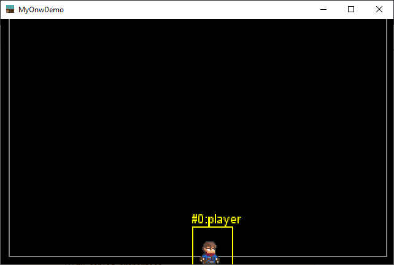

# Simple Game Class

This project intends to propose some guide-lines in a class implementation (with subclasses) to build a simple 2D game
framework with some solid principles.

1. [Main class with user input](01-main_class_width_user_input.md)
2. [Entity & EntityType](02-adding_entity_and_entitytype.md)
3. [Configuration](03-configuration.md)
4. [Physic with World and Material](04-physic_with_world_and_material.md)
5. [Resources management](05-resources_management.md)
6. [Animation on Entity](06-animation_on_entity.md)

McG.
